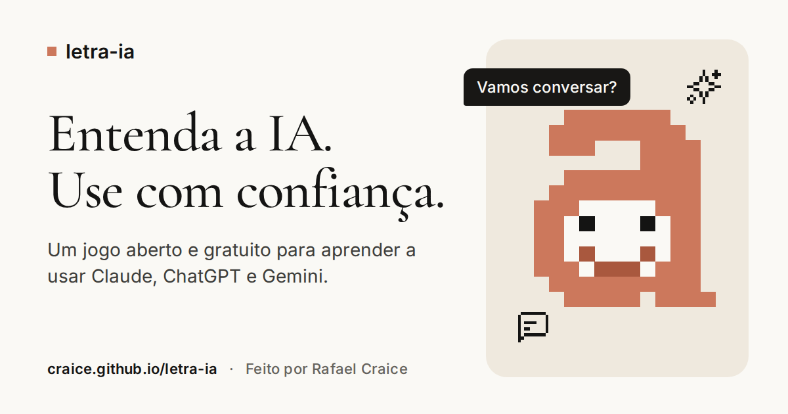

# letra-ia



Feito por **[Rafael Craice](https://craice.me)**, com o [Claude Code](https://claude.com/claude-code).

Um jogo curto, aberto e gratuito para quem quer entender e usar bem as IAs de conversa
(Claude, ChatGPT, Gemini e parecidas), sem precisar saber nada de tecnologia.

**Jogar:** https://craice.github.io/letra-ia/

## O que tem no jogo

Seis capítulos, do básico ao trabalho, com desafios rápidos:

1. O que é uma IA de conversa
2. Pedir bem
3. Conversar, não só perguntar
4. Desconfiar na hora certa
5. Cuidados
6. Trabalho

Em cada fase você lê um conceito curto, escolhe o melhor pedido entre alguns prontos ou
monta um pedido com peças. O jogo explica o porquê de cada acerto e erro. O progresso fica
salvo no seu navegador.

## Rodar no seu computador

Precisa do Node.js 20.19 ou mais novo (ou 22.12+).

```bash
npm install
npm run dev
```

Outros comandos: `npm test` (valida o conteúdo e as regras), `npm run build` (gera a
pasta `dist/`), `npm run check` (checagem de tipos).

## Contribuir

A contribuição mais valiosa é conteúdo: novas fases, melhores exemplos, correções de texto.
Veja [CONTRIBUTING.md](CONTRIBUTING.md). Não precisa saber programar para propor uma fase.

## Do que ele é feito

| Parte | O que usamos | Licença |
|---|---|---|
| Código | [Svelte 5](https://svelte.dev), [Vite](https://vite.dev), TypeScript, [Vitest](https://vitest.dev) | MIT |
| Títulos | [Cormorant Garamond](https://fonts.google.com/specimen/Cormorant+Garamond), via Google Fonts | SIL Open Font 1.1 |
| Texto | [Inter](https://fonts.google.com/specimen/Inter), via Google Fonts | SIL Open Font 1.1 |
| Ícones | [Pixelarticons](https://pixelarticons.com), de Gerrit Halfmann. Só os usados, em `src/assets/icons/` | MIT |
| Visual | Tokens do [DESIGN.md](https://www.designmd.co/d/claude) publicado pelo DesignMD, uma leitura de terceiros do site do Claude | referência |
| Mascote | A Letra, um "a" em pixel-art desenhado para o jogo (`src/ui/Mascot.svelte`) | MIT |
| Hospedagem | GitHub Pages, com deploy por GitHub Actions | |
| Métricas | Google Analytics 4, só no site publicado (`craice.github.io`), sem sinais de publicidade e sem dados pessoais. Forks não enviam nada | |

A única dependência em produção é o Svelte. Fontes vêm do Google Fonts; o resto é embutido no build.

A imagem de compartilhamento é gerada a partir de `docs/og/og.html`: abra em 1200x630 e
capture a tela para `public/og.png`.

## Feito com Claude Code

O letra-ia foi construído de ponta a ponta com o [Claude Code](https://claude.com/claude-code):
o desenho do jogo, a especificação, o plano, o código, os textos das 36 fases, as revisões e
os testes de acessibilidade. A especificação e o plano estão em `docs/superpowers/`, para
quem quiser ver como o processo aconteceu.

## Licenças

Código: [MIT](LICENSE). Conteúdo em `content/`: [CC BY-SA 4.0](LICENSE-CONTENT).

Este projeto é independente e não tem ligação com Anthropic, OpenAI, Google ou qualquer
empresa de IA.
